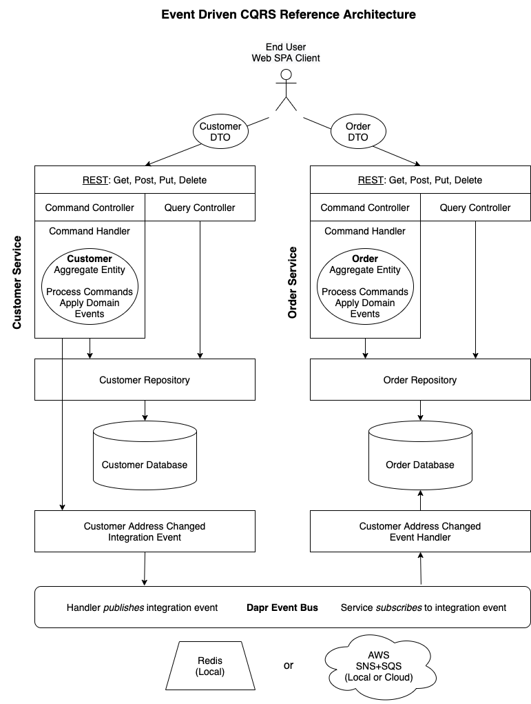

# CQRS Exercise

> **Note**: This exercise implements the CQRS patterns without Event Sourcing, but it does it in a way that is easy to add it later.

## Prerequisites
- [.NET Core SDK](https://dotnet.microsoft.com/download) (latest 5.0 version)
- [Docker Desktop](https://www.docker.com/products/docker-desktop)
- MongoDB Docker: `docker run --name mongo -d -p 27017:27017 -v /tmp/mongo/data:/data/db mongo`
- [MongoDB Client](https://robomongo.org/download):
  - Download Robo 3T only.
  - Add connection to localhost on port 27017.
- [Dapr](https://dapr.io/) (Distributed Application Runtime)
  - [Install Dapr CLI](https://docs.dapr.io/getting-started/install-dapr-cli/)
  - [Initialize Dapr](https://docs.dapr.io/getting-started/install-dapr-selfhost/)

## Packages
- [EventDriven.CQRS](https://www.nuget.org/packages/EventDriven.CQRS)

## Introduction

This project builds on the principles of [Domain Driven Design](https://en.wikipedia.org/wiki/Domain-driven_design) to provide a set of abstractions and reference architecture for implementing the [Command Query Responsibility Segregation](https://docs.microsoft.com/en-us/azure/architecture/patterns/cqrs) pattern, also known as as CQRS. Because entities process commands by emitting domain events, adding [event sourcing](https://microservices.io/patterns/data/event-sourcing.html) at a later time will be relatively straightforward.

The **EventDriven.CQRS.Abstractions** library contains interfaces and abstract base classes to support these concepts:
- **Entity**: A type that has an identity with behavior and state that can change over time.
- **Command**: An object that is sent to the domain for a state change which is handled by a command handler.
- **Event**: A statement of fact about what change has been made to the domain state.

The **Reference Architecture** projects demonstrate how to apply these concepts to two microservices: `CustomerService` and `OrderService`. In addition, each service has *separate controllers for read and write operations*, thus segregating command and query responsibilities, with different sets of models, or Data Transfer Objects (DTO's).
- **Query Controller**: Uses repository to retrieve entities and converts them to DTO's with AutoMapper.
- **Command Controller**: Converts DTO's to domain entities using AutoMapper. Then hands control over to a command handler for executing business logic.
- **Command Broker**: Dispatches the command object to the correct command handler.  
- **Command Handler**: Uses a domain entity to process commands which generate one or more domain events, then requests entity to apply the domain events in order to mutate entity state. Persists entity state to a state store and optionally publishes an integration event which is handled by another microservice.
- **Repository**: Persists entity state to a database.
- **Event Bus**: Used to publish integration events, as well as subscribe to events using an event handler. Dapr is used to abstract away the underlying pub/sub implementation. The default is Redis (for local development), but Dapr can be configured to use other components, such as AWS SNS+SQS.

> **Note**: This example illustrates a *simple* CQRS implementation with a **shared database** and **single service** for both read and write operations. A more sophisticated implementation might entail **separate services and databases** for read and write operations, using integration events to communicate between them. This simple example only uses integration events to communicate between the customer and order services.

<p align="center">
  
</p>

## Exercise: Domain Driven Design with CRQS

> In this exercise you will implement a Web API with .NET 5 that uses Domain Driven Design with CQRS to create a Customer service with command handlers that create, update and remove customers from a MongoDB repository. You will also add a read controller to query customers.

1. Open the solution in Rider or Visual Studio and inspect the folder structure in the **CustomerService** project.
   - At the top level there are the following folders:
     - Configuration
     - Controllers
     - Domain
     - DTO
     - Helpers
     - Mapping
     - Repositories
   - Inside the Domain folder there is a CustomerAggregate folder, which contains the following folders:
     - ComandHandlers
     - Commands
     - Events
2. Have a look at the `Customer` class in the **Domain/CustomerAggregate** folder.
   - Some lines are commented out. Don't uncomment them just yet.
   - Simply note the properties, including the `Address` property, which is an example of using a *C# record* as a DDD *value object*.

3. Create the following commands: `CreateCustomer`, `RemoveCustomer`, `UpdateCustomer`.
   - Go to each of the files in the **Domain/CustomerAggregate/Commands** folder and uncomment the code.
   - Note how each implements `ICommand<CommandResult<Customer>>`.
   - `UpdateCustomer` also adds a ctor that accepts a `Customer`.

4. Go to the **Domain/CustomerAggregate/CommandHandlers** folder and uncomment the code so that create, remove and update commands are handled.
    > **Ask James**: How are each of the command handlers registered?
    - Note that `ICustomerRepository` is injected in order to persist entities to a data store.

5. Open `ICustomerRepository` and `CustomerRepository` files.
   - An `IDocumentRepository<Customer>` (from a library called URF) is injected for handling read and writes to MongoDB.

6. Go to the **Domain/CustomerAggregate/Events** folder and open `CustomerCreated` to uncomment the code.
   - Note that it extends `DomainEvent` and accepts an id for the ctor.

7. Open `ICustomerAggregate` in the **Domain/CustomerAggregate** folder.
   - Uncomment the code to create the interface.
   - Note that is extends two interfaces:
     - `ICommandProcessor`: Process a command to generate domain events
     - `IEventApplier`: Apply domain events to mutate the state of an entity.

8. Open the `Customer` class in the **Domain/CustomerAggregate** folder and uncomment the code to implement `ICustomerAggregate`.
   - Note that `Process` accepts a command and returns domain events.
     - This is so that at a future date events can be writen to an event store.
   - Note that `Apply` accepts a domain event in order to mute that state of the entity.

9. Go to the **DTO/Read** and **DTO/Write** folders to inspect `Customer`, `Address` and `CustomerView` classes.
   - Note that `CustomerView` is a flattened version of `Customer`.

10. Open `CustomerCommandController` in the **Controllers** folder and uncomment the code.
    - Note that `Customer` DTO's are passed in and out of each controller action.
    - AutoMapper is used to map DTO's to the `Customer` domain entity. Inspect the mappings between DTO's and entities.

11. Open `CustomerQueryController` in the **Controllers** folder and uncomment the controller actions.
    - Note that `ICustomerRepository` is injected and that `CustomerView` is mapped from the `Customer` entity and returned as a result.

12. Open the `Startup` class to register services in the `ConfigureServices` method.
    - Uncomment the code to add necessary configurations and registrations.

### Run the Exercise

1. Build the solution, set some breakpoints, then run with the IDE debugger.
2. Create some customers.
    - Open http://localhost:5000/swagger
    - Execute posts using contents of **customers.json**.
    - Copy post response, modify fields, then execute puts.
        - Make sure to copy `etag` value from last response, or you will get a concurrency error.
    - Copy `id` and `etag` values to execute deletes.
    - Execute gets to retrieve customers.
    - View customers database collections using Robo 3T.
3. Create some orders.
    - Execute posts using contents of **orders.json**.
    - Copy post response, modify fields, then execute puts.
        - Make sure to copy `etag` value from last response, or you will get a concurrency error.
    - Copy `id` and `etag` values to execute deletes.
    - Execute gets to retrieve orders.
    - View orders database collections using Robo 3T.

## Exercise: Integration Events using Dapr for Pub Sub

> In this exericise you will create an integration event whenever a customer address is updated, so that the address for customer orders are updated in the repository for the Order service.

1. Go to the **Common** project and uncomment code for `Address` in the **Integration/Models** folder and for `CustomerAddressUpdated` in the **Integration/Events** folder.
   - Note that these are *integration* events, not *domain* events, since they are used to publish events from one service that are consumed by another service using a pub/sub mechanism such as AWS SNS+SQS.
   - Note that `CustomerAddressUpdated` extends `IntegrationEvent`.

2. Open `AutoMapperProfile` in the **CustomerService** project and uncomment the code to map integration DTO's to entities.
   - Also open `AutoMapperProfile` in the **OrderService** project and uncomment the code there.

3. Update the `Handle` method in the `UpdateCustomerCommandHandler` class to call `PublishAsync` on the event bus, passing a `CustomerAddressUpdated` DTO.
   
4. Open `CustomerAddressUpdatedEventHandler` in the **Integration/EventHandlers** folder of the **OrderService** project and uncomment the code to extend `IntegrationEventHandler` and override the `HandleAsync` method.
   - Note that the method accepts a `CustomerAddressUpdated` integration event and calls `UpdateOrderAddress` on the order repository.

5. Open the `Startup` class and uncomment the code in `ConfigureServices` to add configurations and registrations.
   - Note that we are registering `CustomerAddressUpdatedEventHandler` as a singleton.

6. Uncomment code in the `Configure` method to use Cloud Events, map subscribe handlers, and map Dapr Event Bus endpoints, subscribing with the event handler.
   - Note that a parameter of type `CustomerAddressUpdatedEventHandler` is added to the `Configure` method so that you can pass it to the `eventBus.Subscribe` method.

### Run the Exercise

> **Note**: Make sure to stop any previously running instances of the solution.

1. Run Dapr Dashboard.
   - Then open http://localhost:8080 to view containers after executing `dapr run` commands.
    ```
    dapr dashboard
    ```
2. Use Dapr to run the customer service.
    ```
    dapr run --app-id customer-service --app-port 5000 --components-path ../dapr/components -- dotnet run
    ```
3. Use Dapr to run the order service.
    ```
    dapr run --app-id order-service --app-port 5150 --components-path ../dapr/components -- dotnet run
    ```
4. Update the address of a customer who has order.
   - Note the address is also updated for the customer's orders.
   - Observe log messages in terminal when integration events are published and handled.
5. To **debug** services, you will need to use **Visual Studio Code** with the *Dapr extension*.
   - Open instances of VS Code at both CustomerService and OrderService.
   - If .vscode folder not present:
     - First create build and debug artifacts.
     - Then from the task palette run `Dapr: Scaffold Dapr Tasks`.
       - Enter values for launch, app id (customer-service) and port (5000).
       - Enter values for launch, app id (order-service) and port (5050).
   - Switch to the Debug tab and select "with Dapr" configuration.
   - Set breakpoints as needed and press F5 to start debugging.
